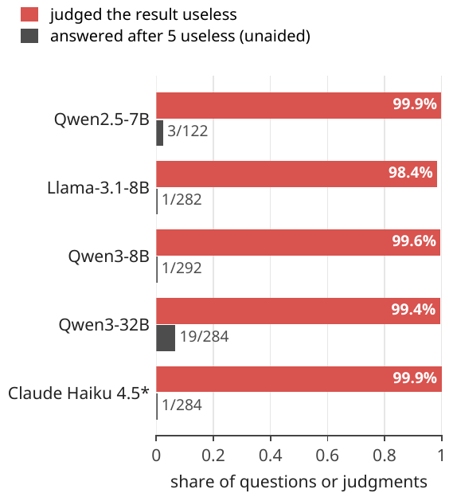
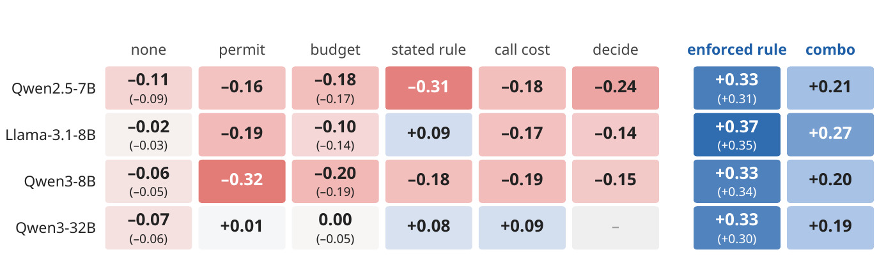

# Judged Useless, Queried Anyway

Code, prompts and data for the paper **Judged Useless, Queried Anyway: Tool-Using Agents Rarely Turn Their Own Evidence Judgments into Stopping Decisions**
(Chubin Zhang, Zhenglin Wan, Xingrui Yu, Jingxuan Wu, Yaxin Zhou, Ivor Tsang, Bo An).

When a tool keeps returning nothing useful, an agent should stop relying on it. The agents we test call a failing
source's results useless almost every time, yet after five such judgments in a row they rarely answer:

<p align="center"></p>

Telling them more (that they may answer from memory, the step budget, the stopping rule, the price of a call, or
their running count of useless judgments) changes *when* they stop but not *what* they stop on. Stopping follows the
evidence only when the harness enforces the integration step.

## What you can do with this repository

| I want to ... | Where |
|---|---|
| test whether my agent's stopping follows its own judgments of its evidence | [Measure Δ on your agent](#measure-δ-on-your-agent) |
| add the enforced integration step to my agent harness | [Add the integration step](#add-the-integration-step-to-your-harness) |
| reuse the prompts (agent, conditions, side-channel question, belief probe) | [`prompts/`](prompts) |
| run any model in the controlled source-failure environment (HotpotQA, FEVER) and score it | [`experiments/`](experiments) |
| get the step-by-step judgments and actions of every model and condition in the paper, and reproduce its numbers | [`data/`](data) |

## Install

```bash
git clone https://github.com/bennidict23/judged-useless-queried-anyway.git
cd judged-useless-queried-anyway
pip install -e .          # the toolkit `judged_useless`: pure Python, no dependencies
python examples/compute_delta.py
```

## Measure Δ on your agent

Success alone cannot tell you what an agent's stopping responds to: an agent that stops at a fixed step, one that
waits for the deadline and one that stops after enough useless evidence can score alike. The **time-matched contrast
Δ** separates them. At the same decision step *t*, it compares the probability of answering when every result so far
was judged useless with the probability of answering when the latest result was judged useless but an earlier one was
judged useful.

| Δ | the agent's stopping ... |
|---|---|
| > 0 | integrates its own useless judgments |
| ≈ 0 | follows the clock or the deadline |
| < 0 | follows earlier useful evidence instead |

Record, for each episode, the actions and the agent's judgment of each observation (one JSON object per line):

```json
{"question_id": "q17", "actions": ["search", "search", "lookup", "search", "finish"],
 "judgments": ["USELESS", "USEFUL", "USELESS", "USELESS"]}
```

`judgments[k]` is the judgment of the observation returned by `actions[k]` (`"USELESS"`, `"USEFUL"` or `null`).
The judgments can come from a side-channel question asked on a copy of the conversation
([`prompts/08_side_channel_judgment_question.txt`](prompts/08_side_channel_judgment_question.txt)) or from the
agent's own reasoning, read with `stated_judgment()` at no extra cost.

```python
from judged_useless import load_jsonl, time_matched_contrast, answer_rate_after_run

episodes = load_jsonl("examples/qwen3-8b_unaided_test300.jsonl")
time_matched_contrast(episodes)      # {'delta': -0.065, 'ci_low': -0.095, 'ci_high': -0.039, 'cells': {...}, ...}
answer_rate_after_run(episodes, k=5) # how often the agent answers once it has judged 5 results in a row useless
```

The two example files are the unaided Qwen3-8B agent (Δ = −0.065) and the same agent with the enforced rule
(Δ = +0.329) on our 300 test questions, exactly as reported in the paper. Δ pools decisions after 3 to 6 observations (`t_min`, `t_max`) and
excludes the final action of the eight-action budget, which is the last chance to answer; with a budget of *B*
actions, use `t_max = B - 2`. Δ needs both kinds of histories at the same step, so collect episodes in which a source
fails from the start as well as episodes in which it fails later or recovers (as in our failure regimes).
Intervals come from a bootstrap over questions.

<p align="center"></p>
<p align="center"><sub>Δ for every model and condition in the paper (blue: Δ > 0; red: Δ < 0; fresh-question replication in parentheses).</sub></p>

## Add the integration step to your harness

```python
from judged_useless import IntegrationRule, stated_judgment, FORCE_SYSTEM_SUFFIX, FORCE_USER_MESSAGE

rule = IntegrationRule(k=5, source="stated")   # or source="side_channel"
for step in episode:
    thought, action = agent.propose(history)                 # your agent's next turn
    if step > 0 and rule.update(stated_judgment(thought)):   # judgment of the latest observation
        system_prompt += FORCE_SYSTEM_SUFFIX                 # from now on only the answer action remains
        history[-1] += "\n\n" + FORCE_USER_MESSAGE
        thought, action = agent.propose(history)
    ...
```

`source="side_channel"`: after each observation, ask `SIDE_CHANNEL_QUESTION` on a scratch copy of the conversation and
pass `parse_side_channel(reply)`; any reply other than USELESS resets the run.
`source="stated"`: read the agent's own thought with `stated_judgment()`; USEFUL resets the run and a thought with no
explicit judgment leaves it unchanged. A runnable toy example is in [`examples/harness_example.py`](examples/harness_example.py).

## The source-failure environment

Questions come from the HotpotQA distractor development set; each question has its own knowledge base of its ten
paragraphs, and the agent has `search`, `lookup` and `finish` with an eight-action budget. A failed observation is
replaced by a paragraph from another question's knowledge base, so whether each result is useful is known.

| regime | which observations fail |
|---|---|
| `clean` | none |
| `persistent` | every observation |
| `recover_after_1`, `_2`, `_3` | the first 1, 2 or 3 |
| `late_onset_from_3` | the third and every later one |

Harder failures (`plausible`: the question's own distractor paragraphs; `answerless`: its own pages with the supporting
facts removed), longer recoveries, a backup tool and FEVER fact verification are also included. Question lists:
[`experiments/manifests/`](experiments/manifests) (`dev100` for development, `test300` for the main results,
`fresh300` for a fresh replication). To run a model and score it, see [`experiments/README.md`](experiments/README.md):

```bash
cd experiments
python run_gate2.py --arm rule_k5_side --model qwen3-8b --split test300 --gpu 0
python evaluate.py results_v2/<run dir>      # success per regime, mean6 and Δ
```

## Repository layout

```
judged_useless/   toolkit: Δ, answer rate after k useless judgments, the integration rule, the keyword reader
examples/         example episodes in the toolkit's format and runnable examples
prompts/          every prompt used in the paper, as plain text
experiments/      the source-failure environment, agents and conditions, and evaluate.py to score a run
data/             every episode of the paper's main experiments, and a script that reproduces Figure 3 and Table 2
```

## Data

[`data/episodes/`](data/episodes) holds every episode of the paper's main experiments in the toolkit's format: four
open models in eight conditions on the 300 test questions, and the replication on 300 fresh questions, with the
agent's judgment of every observation, its actions and whether it answered correctly (43 files, under 1 MB).

```bash
python data/reproduce_paper.py   # recomputes every Δ in Figure 3 and every mean6 in Table 2; all 43 cells match
```

The full trajectories (with the agents' text) and the annotation labels will be added later.

## Citation

```bibtex
@misc{zhang2026judgeduseless,
  title  = {Judged Useless, Queried Anyway: Tool-Using Agents Rarely Turn Their Own Evidence Judgments into Stopping Decisions},
  author = {Zhang, Chubin and Wan, Zhenglin and Yu, Xingrui and Wu, Jingxuan and Zhou, Yaxin and Tsang, Ivor and An, Bo},
  year   = {2026}
}
```

## License

Code: MIT. Episode data in `data/`: CC BY 4.0. HotpotQA (CC BY-SA 4.0) and the FEVER claims and Wikipedia pages in `experiments/fever_data.json` (CC BY-SA 3.0)
keep their original licenses.
