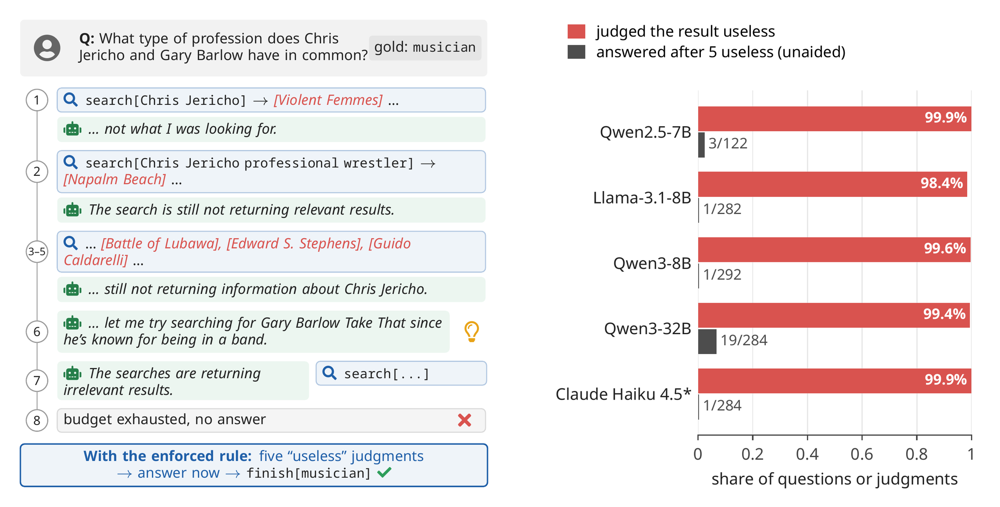

<div align="center">

# Judged Useless, Queried Anyway

**Tool-Using Agents Rarely Turn Their Own Evidence Judgments into Stopping Decisions**

Chubin Zhang<sup>1</sup>, Zhenglin Wan<sup>2</sup>, Xingrui Yu<sup>3,4‡</sup>, Jingxuan Wu<sup>5</sup>, Yaxin Zhou<sup>6</sup>, Ivor Tsang<sup>1,3,4</sup>, Bo An<sup>1</sup>

<sub><sup>1</sup>Nanyang Technological University &nbsp; <sup>2</sup>National University of Singapore &nbsp; <sup>3</sup>CFAR, A\*STAR &nbsp; <sup>4</sup>IHPC, A\*STAR<br><sup>5</sup>UNC-Chapel Hill &nbsp; <sup>6</sup>Carnegie Mellon University &nbsp; <sup>‡</sup>Corresponding author</sub>

<br>

[](https://arxiv.org/abs/2610.06191)
[](data)
[](#-quick-start)
[](LICENSE)

🚀 **[Quick start](#-quick-start)** &nbsp;·&nbsp; 🔍 **[Test your agent](#-test-your-agent)** &nbsp;·&nbsp; 🔧 **[Integration step](#-add-the-integration-step)** &nbsp;·&nbsp; 📊 **[Reproduce](#-reproduce-the-paper)** &nbsp;·&nbsp; 📝 **[Citation](#-citation)**

</div>

<br>

<p align="center"></p>
<p align="center"><sub><b>Left:</b> a real trajectory of Claude Haiku 4.5 with a persistently failing source. It calls every result irrelevant and recalls at step 6 that Barlow is in a band, yet searches until its budget runs out; with the enforced rule, it answers correctly. <b>Right:</b> how often each agent judged a failing source's result useless (red), and how often the unaided agent answered after five useless judgments in a row (gray). *Judgments from its enforced-rule run on the same questions.</sub></p>

When a tool keeps returning nothing useful, an agent should stop relying on it. The agents we test know when that
happens, but they do not act on it:

- **Agents judge correctly but do not act on their judgments.** They call a failing source's results useless 97–100%
  of the time, yet their stopping ignores these judgments.
- **Telling agents more changes when they stop, not what they stop on.** Permission to answer from memory, a step
  budget, a stopping rule or a price per call written into the prompt, or the running count of useless judgments,
  moves the stopping point without tying it to the evidence.
- **An enforced integration step makes stopping follow the evidence.** When the harness leaves only `finish` after
  five consecutive results the agent judged useless, success on a failing source rises for every model.
- **The pattern replicates** on 300 fresh questions and on fact verification. A larger open model, a reasoning mode
  and an RL-trained search agent still largely fail to stop on the evidence.

## 🚀 Quick start

```bash
pip install git+https://github.com/bennidict23/judged-useless-queried-anyway
```

| I want to ... | See |
|---|---|
| test whether my agent's stopping follows its own judgments of its evidence | 🔍 [Test your agent](#-test-your-agent) |
| make my agent stop on them | 🔧 [Add the integration step](#-add-the-integration-step) |
| reproduce the main results (Figure 3, Table 2) from the released episodes, on a CPU in about a minute | 📊 [Reproduce the paper](#-reproduce-the-paper) |
| run a model in the controlled source-failure environment (HotpotQA, FEVER) | 🧪 [Run the environment](#-run-the-environment) |
| reuse the prompts: agent, conditions, side-channel question, belief probe | 💬 [`prompts/`](prompts) |

## 🔍 Test your agent

Success alone cannot tell you what an agent's stopping responds to: an agent that stops at a fixed step, one that
waits for the deadline and one that stops after enough useless evidence can score alike. The **time-matched contrast
Δ** separates them. At the same step, it compares how often the agent answers when every result so far was judged
useless with how often it answers when the latest result was judged useless but an earlier one was judged useful.

| Δ | the agent's stopping ... |
|:---:|---|
| **> 0** | integrates its own useless judgments |
| **≈ 0** | follows the clock or the deadline |
| **< 0** | follows earlier useful evidence instead |

Record each episode as one JSON line with the agent's actions and its judgment of each observation:

```json
{"question_id": "q17", "actions": ["search", "search", "lookup", "search", "finish"],
 "judgments": ["USELESS", "USEFUL", "USELESS", "USELESS"]}
```

```python
from judged_useless import load_jsonl, time_matched_contrast, answer_rate_after_run

episodes = load_jsonl("my_episodes.jsonl")   # or one of the files in examples/ or data/episodes/
time_matched_contrast(episodes)              # {'delta': -0.065, 'ci_low': -0.095, 'ci_high': -0.039, ...}
answer_rate_after_run(episodes, k=5)         # how often it answers after 5 useless judgments in a row
```

`judgments[k]` judges the observation returned by `actions[k]` (`"USELESS"`, `"USEFUL"` or `null`). Get the judgments
by asking a one-word question on a copy of the conversation
([`prompts/08_side_channel_judgment_question.txt`](prompts/08_side_channel_judgment_question.txt)), or read them from
the agent's own reasoning at no extra cost with `stated_judgment()`.

<p align="center"></p>
<p align="center"><sub>Δ for every model and condition in the paper (blue: Δ > 0, red: Δ < 0; replication on 300 fresh questions in parentheses). Only the enforced rule, alone or combined with the budget, makes Δ positive for every model.</sub></p>

<details>
<summary><b>📐 Which decisions Δ uses</b></summary>
<br>

Δ pools the decisions after 3 to 6 observations (`t_min`, `t_max`) and leaves out the final action of the
eight-action budget, which is the last chance to answer; with a budget of *B* actions, use `t_max = B - 2`. It needs
both kinds of histories at the same step, so collect episodes in which a source fails from the start as well as
episodes in which it fails later or recovers. Cells are pooled with Mantel–Haenszel weights, and the interval comes
from a bootstrap over questions.
</details>

## 🔧 Add the integration step

Let the harness, not the prompt, act on the agent's judgments: once five results in a row are judged useless, leave
the agent only the answer action.

```python
from judged_useless import IntegrationRule, stated_judgment

rule = IntegrationRule(k=5, source="stated")    # or "side_channel" for judgments from the side-channel question
if rule.update(stated_judgment(thought)):       # after each observation, on the agent's latest thought
    ...                                         # allow only the answer action from now on
```

`python examples/harness_example.py` shows it in a complete agent loop, with the prompts that switch to answering.

## 📊 Reproduce the paper

[`data/episodes/`](data) holds every episode of the paper's main experiments: four open models in eight conditions on
300 test questions, and the replication on 300 fresh questions, with the agent's judgment of every observation, its
actions and whether it answered correctly (43 files, under 1 MB). One command recomputes every Δ in Figure 3 and the open models' success rates in Table 2:

```bash
git clone https://github.com/bennidict23/judged-useless-queried-anyway.git
cd judged-useless-queried-anyway
python data/reproduce_paper.py
```

The fields are described in [`data/README.md`](data/README.md). The full trajectories, with the agents' text, and the
annotation labels will be added later.

## 🧪 Run the environment

Questions come from the HotpotQA distractor development set, each with its own knowledge base of ten paragraphs. The
agent has `search`, `lookup` and `finish` and a budget of eight actions. A failed observation is replaced by a
paragraph from another question's knowledge base, so whether each result is useful is known.

| regime | which observations fail |
|---|---|
| `clean` | none |
| `persistent` | every observation |
| `recover_after_1`, `_2`, `_3` | the first 1, 2 or 3 |
| `late_onset_from_3` | the third and every later one |

Harder failures (`plausible`: the question's own distractor paragraphs; `answerless`: its own pages without the
supporting facts), longer recoveries, a backup tool and FEVER fact verification are included too.

```bash
pip install -r requirements.txt   # vLLM for open models, anthropic for Claude
cd experiments
python run_gate2.py --arm rule_k5_side --model qwen3-8b --split test300 --gpu 0
python evaluate.py results_v2/<run dir>      # success per regime, mean6 and Δ
```

Every condition, model and script is listed in [`experiments/README.md`](experiments/README.md).

## 📝 Citation

```bibtex
@misc{zhang2026judgeduseless,
  title         = {Judged Useless, Queried Anyway: Tool-Using Agents Rarely Turn Their Own Evidence Judgments into Stopping Decisions},
  author        = {Zhang, Chubin and Wan, Zhenglin and Yu, Xingrui and Wu, Jingxuan and Zhou, Yaxin and Tsang, Ivor and An, Bo},
  year          = {2026},
  eprint        = {2610.06191},
  archivePrefix = {arXiv},
  primaryClass  = {cs.AI},
  url           = {https://arxiv.org/abs/2610.06191}
}
```

## 📜 License

Code: MIT. Episode data in `data/`: CC BY 4.0. HotpotQA (CC BY-SA 4.0) and the FEVER claims and Wikipedia pages in
`experiments/fever_data.json` (CC BY-SA 3.0) keep their original licenses.
